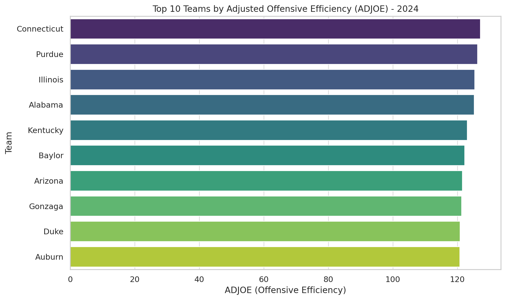

# Task_05_Descriptive_Stats

# Task 05 – Descriptive Statistics and LLM Reasoning

This project explores the capabilities and limitations of large language models (LLMs), such as ChatGPT, in answering natural language questions about structured sports data. Using a dataset of 362 Division I college basketball teams from the 2024 season, I performed descriptive statistical analysis, built visualizations, and tested 13 prompts across factual, comparative, and strategic categories.

The goal was not only to test whether an LLM can extract accurate insights but also to understand where and why it might fail — including examples of both false positives and false negatives. This work highlights the potential and current constraints of using LLMs for automated data reasoning.

Key components of the project:
- 🧪 Descriptive statistics using Python (Pandas)
- 📊 Visual insights on team offense, defense, tempo, and performance
- 🤖 Prompt engineering across 13 custom questions
- ✅ Human validation of LLM responses
- ⚠️ Documented errors to reflect model limitations

This research was completed as part of my role as a Research Analyst under the OPT program at Syracuse University’s iSchool.
## Descriptive Statistics Summary
The dataset contains 362 Division I college basketball teams from the 2024 season, each described by offensive, defensive, tempo, shooting, rebounding, and postseason metrics. Below is a statistical overview of key numeric variables:

Metric	Mean	Min	Max	Std Dev
Games Played (G)	30.97	24	36	1.89
Wins (W)	16.90	1	31	5.77
Adj. Off. Efficiency (ADJOE)	105.17	85.1	127.1	7.55
Adj. Def. Efficiency (ADJDE)	105.17	85.5	120.7	5.99
Power Rating (BARTHAG)	0.49	0.03	0.98	0.26
Effective FG% (EFG%)	50.40	41.0	59.9	3.06
Turnover % (TOR)	17.14	12.0	24.0	2.02
Steal % (TORD)	19.05	11.5	27.7	2.55
Off. Rebound % (ORB)	28.84	17.7	39.1	3.81
Def. Rebound % Allowed (DRB)	29.83	20.5	39.7	3.18
Free Throw Rate (FTR)	32.98	21.4	50.0	4.75
3P Shooting % (3P_O)	33.71	24.7	41.2	2.52
Adjusted Tempo (ADJ_T)	67.49	60.0	75.1	2.44
Wins Above Bubble (WAB)	–8.23	–24.8	11.3	6.91

🏀 Postseason Summary:
68 teams participated in March Madness (18.7% of dataset)

Most common elimination round: Round of 64 (R64) with 32 teams

Champions: Connecticut (UConn) with the highest ADJOE (127.1)

📌 Observations:
Teams with high BARTHAG and ADJOE often correlate with more wins.

Most teams operate between 65–70 possessions per game.

Offensive efficiency shows a stronger correlation with wins (+0.717) than defensive efficiency (–0.670).

Some teams overachieved in win totals despite low WAB, reflecting weaker strength of schedule.

## 📊 Visual Insights from 2024 College Basketball Season

### 🔥 Top 10 Teams by Offensive Efficiency (ADJOE)
  
*Connecticut, Purdue, and Alabama lead the nation in offensive power, each scoring over 125 points per 100 possessions.*

---

### 🛡️ Top 10 Teams by Defensive Efficiency (ADJDE)
.png)  
*Houston and Iowa State stand out defensively, holding opponents under 90 points per 100 possessions.*

---

### ⚖️ Wins vs. Power Rating (BARTHAG)
.png)  k
*Higher wins generally correlate with stronger power ratings, though some efficient teams underperformed in win count.*

---

### 🏃 Adjusted Tempo Distribution
.png)  
*Most teams play between 65–70 possessions per 40 minutes. Only a few push past 72, indicating very fast-paced styles.*

## Natural Language Questions to LLM
As part of this research, I designed 13 natural language questions to test the reasoning capability of a large language model (ChatGPT) over structured basketball data. These were categorized into three levels:

🟢 1. Factual Questions (Basic Retrieval)
Questions based on simple maximums, counts, or single-column logic.

Examples:

How many teams played in the 2024 college basketball season?

Which team had the highest Adjusted Offensive Efficiency (ADJOE)?

Who had the best defense based on ADJDE?

🟡 2. Comparative & Relational Questions
Involving comparisons across multiple variables or grouped data.

Examples:

Which team had high offense but weak defense?

Which conference had the most high-performing teams?

Does faster tempo correlate with more wins?

🔴 3. Strategic & Insightful Questions
Designed to simulate coaching, planning, or forecasting scenarios.

Examples:

Who was the most balanced team in terms of offense and defense?

Which teams overachieved relative to their WAB score?

Should a coach focus on offense or defense to improve win totals?

🤖 LLM Evaluation & Error Logging
All 13 prompts were tested with ChatGPT (GPT-4o).

For each question, the LLM’s response was recorded and manually validated using Python scripts.

Two types of model failures were documented:

❌ False Positive: LLM gave a confident but incorrect answer.

❌ False Negative: LLM claimed no answer existed when one did.

